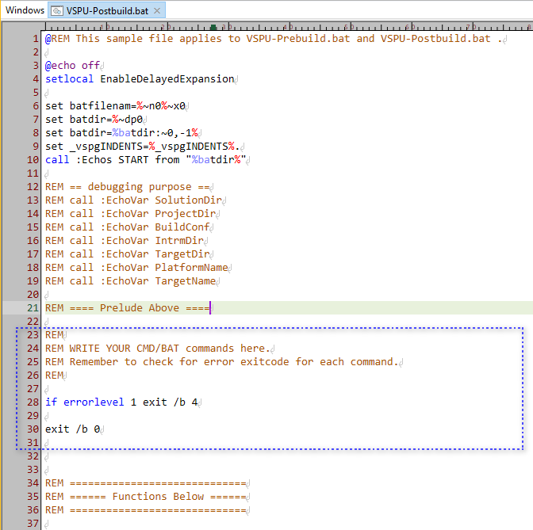

This `VSPU-Postbuild.bat.sample` is the shared template file for 
* VSPU-Prebuild.bat
* VSPU-Postbuild.bat

At Visual Studio project Prebuild stage(before any .cpp -> .obj compiling starts), `VSPU-Prebuild.bat` hook files will be searched and executed. 

At Visual Studio project Postbuild stage(after EXE is generated), `VSPU-Postbuild.bat` hook files will be searched and executed. 

These .bat files share the same file structure. As VSPG user, after making a copy of this sample, you should keep "Prelude" part of it, and write your own batch commands after the Prelude. 

For concrete usage case, see example [embed-svnrev](../../demo-vsprojs/embed-svnrev/).
