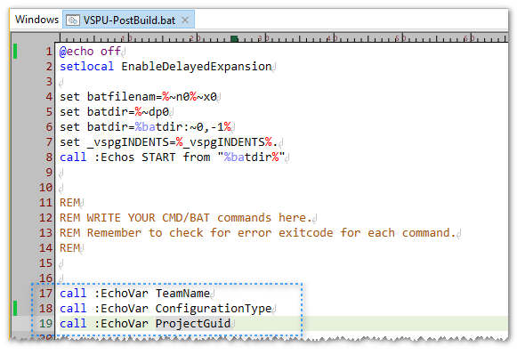
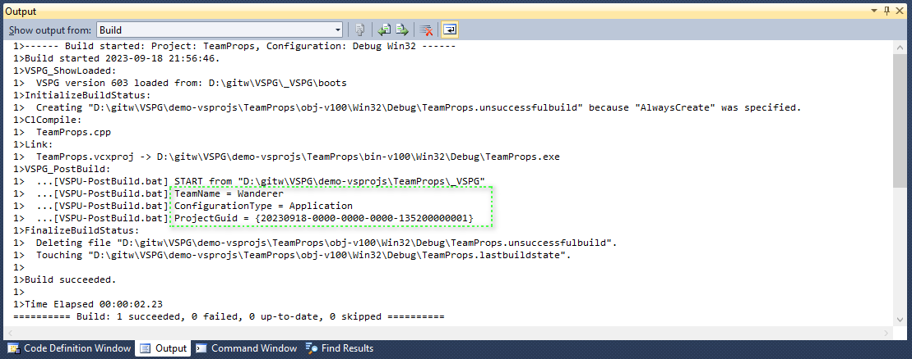
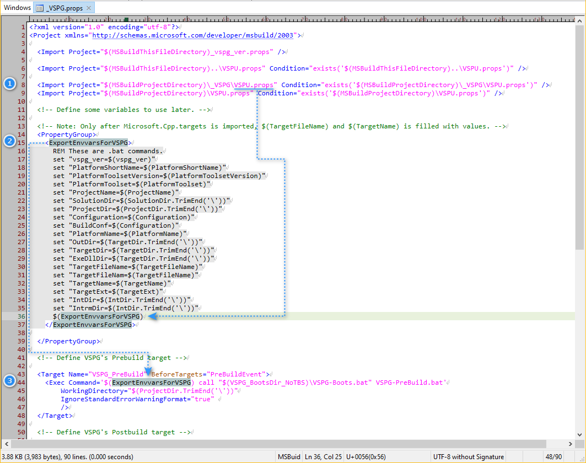

## Summary

This example demonstrates a hook feature provided by VSPG, and this feature loads 
user custom `.prop` files into a Visual Studio project file(MSBuild project file),
so that we can create and use some custom variables during the build process.

## Usage Scenario 

Suppose that, in our `VSPU-PreBuild.bat` or `VSPU-PostBuild.bat`, we want to refer to current 
project's project-GUID, how can we do that?

Background: A normally created .vcxproj/.csproj has a <ProjectGuid> value assigned to itself. 
For example, open TeamProps.vcxproj in a text editor, and we can find a line like this:

```
    <ProjectGuid>{20230918-0000-0000-0000-135200000001}</ProjectGuid>
```

then `{20230918-0000-0000-0000-135200000001}` is the project-GUID. The purpose of project-GUID
is that: 
* If a Visual Studio solution file(.sln) contains two or more .vcxproj-s, different 
project-GUIDs helps Visual Studio distinguish between them. 
* If there is dependency between two .vcxproj-s, the main-project will refer to child-project's
GUID for identification.

## How to

### Step 1, create a custom `VSPU.props`

We first create a file named `VSPU.props`, which can be place side-by-side with .vcxproj, 
or in a subdir named `_VSPG`.

What I have said in [simprint's guide](../simprint/README.md) applies here as well: 
* If we intend this `VSPU.props` to be team-wide, we should place it in `_VSPG` subdir.
* If we intend this `VSPU.props` to be personal, we should place it side-by-side with .vcxproj .

In this example, we place `VSPU.props` into `_VSPG`.

The content of  `VSPU.props` is listed below:

```
<?xml version="1.0" encoding="utf-8"?>
<Project xmlns="http://schemas.microsoft.com/developer/msbuild/2003">

  <PropertyGroup>
    <ExportEnvvarsForVSPG>
      $(ExportEnvvarsForVSPG)
      REM .bat syntax below:
      set "TeamName=Wanderer"
      set "ConfigurationType=$(ConfigurationType)"
      set "ProjectGuid=$(ProjectGuid)"
    </ExportEnvvarsForVSPG>
  </PropertyGroup>

</Project>
```

Here, we define three batch script variables, one of which is ProjectGuid, whose value is `$(ProjectGuid)`.

When Visual Studio starts the build process(running MSBuild on TeamProps.vcxproj), the `$(ProjectGuid)` 
will expand to the value we have defined in `TeamProps.vcxproj`. And then, 

```
    set "ProjectGuid=$(ProjectGuid)"
```
becomes:
```
    set "ProjectGuid={20230918-0000-0000-0000-135200000001}"
```

And the batch variable `ProjectGuid` will be seen in our `VSPU-PreBuild.bat` and `VSPU-PostBuild.bat`.


### Step 2, create a custom `VSPU-PostBuild.bat`

In this example, we create `VSPU-PostBuild.bat` in subdir `_VSPG` as well. 

In this file, we just `echo` the value of those three batch variables we have defined in `VSPU.props`, 
enough to verify that we can acquire the value of `ProjectGuid` in our custom .bat .




Now, let's see how the .vcxproj behaves. Great, work as desired.



Hint: We use `call :EchoVar` here instead of raw `echo`, because `:EchoVar` prints indention and
 .bat filename prefix for us, which is eye-friendly.


## How it works

VSPG framework bootstrap file `_VSPG.props` has following code at its start.



(1) We define MSBuild variable `ExportEnvvarsForVSPG` in our `VSPU.props`.

(2) In `_VSPG.props`, some commonly used variables(`ProjectName`, `BuildConf` etc) are pre-pended 
to `ExportEnvvarsForVSPG` .

(3) `_VSPG.props` uses a MSBuild technique called "Target Hook" to inject a target named 
"VSPG_PreBuild" who is designed to be executed before built-in target "PreBuildEvent".

So, when "VSPG_PreBuild" is executed, MSBuild engine expands the content in `<Exec Command='...'/>` 
to create a temporary .bat file, and this very .bat is executed.

Our `set "varname=varval"` batch statements are right in that very temporary .bat file, 
so our goal is achieved.


