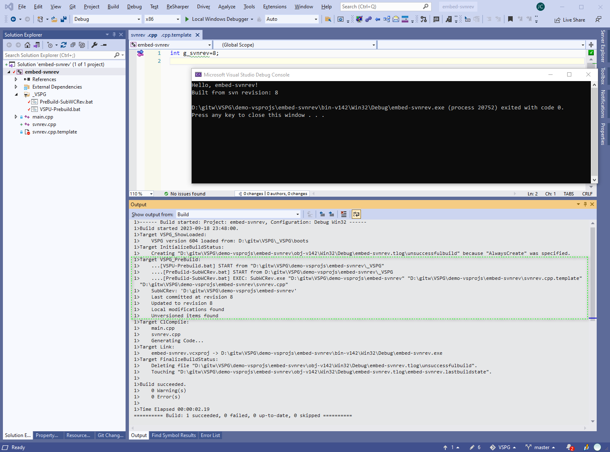

This demo project shows how we can use Subversion's bundled program `SubWCRev.exe` to embed svn revision number into an C++ source file, of course in VSPG way.



The `svnrev.cpp` has a single line of code:

```
int g_svnrev=8;
```

Although `svnrev.cpp` is added to vcxproj to be compiled into final EXE, however, `svnrev.cpp` is not in the git-repo. In other word, when a user checks out this project, `svnrev.cpp` does NOT exist.

Then how does VSIDE compile `svnrev.cpp` ? The answer is, it is created on the fly when we hit F7(Build). 

We have `Team-Prebuild.bat`, so that this .bat is executed before VSIDE(MSBuild) does any .cpp -> .obj compiling.

In `Team-Prebuild.bat`, we call `PreBuild-SubWCRev1.bat`, which does the actual work, executing the following command.

```
SubWCRev.exe "D:\gitw\VSPG\demo-vsprojs\embed-svnrev" "D:\gitw\VSPG\demo-vsprojs\embed-svnrev\.\svnrev.cpp.template" "D:\gitw\VSPG\demo-vsprojs\embed-svnrev\.\svnrev.cpp"
```

That is, svn related macro references in `svnrev.cpp.template` is replaced with actual values, and the result is a newly created file `svnrev.cpp`.

To be concrete, `svnrev.cpp.template` has content:

```
int g_svnrev=$WCREV$;
```

So the resulting int `svnrev.cpp` is something like:

```
int g_svnrev=8;
```

The \<SrcVersionFile\> and \<DstVersionFile\> passed to `SubWCRev.exe` is not hardcoded in `PreBuild-SubWCRev1.bat`, instead, they are recorded in `SubWCRev.csv` to ease adding/modifying new file pairs, one pair per line, so `PreBuild-SubWCRev1.bat` becomes generic.

