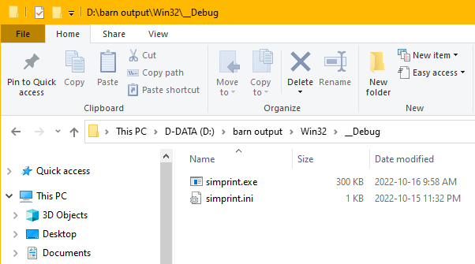

## Summary

This example demonstrates the most commonly used, and perhaps the most intuitive action of VSPG.

By using a triggering file named `VSPU-CopyOrClean.bat`, you tell VSPG to copy output EXE file
to extra target directories(here called barn directories, or barns).

Normally, you don't write `VSPU-CopyOrClean.bat` by hand, which is a bit complicated. 
You just get its content from [`VSPU-CopyOrClean.bat.sample`](../../_VSPG/samples/VSPU-CopyOrClean.bat.sample) 
and do minor modification according to your own environment.

In Visual Studio IDE, build this project(simprint.vcxproj), you see the following build output:


The output text in dashed blue frame is output by VSPG.

And we see that `simprint.exe` and `simprint.ini` are copied to two barn directories:

```
D:\barn\Win32\__Debug
D:\barn output\Win32\__Debug
```



## Explanation of details

### A manual tweak is need vcxproj 

To bootstrap VSPG from a specific vcxproj, an `<Import>` statement need to exist at end of the .vcxproj file. For a vcxproj file created by Visual Studio project wizard, we need to add it manually.

So you see the following content at end of simprint.vcxproj .


Be aware, we must assign a correct directory for `<VSPG_BootsDir_NoTBS>`, otherwise, VSIDE will fail to load this vcxproj.

### VSPU-CopyOrClean.bat

In `VSPU-CopyOrClean.bat`, we set three variables.

(assuming this project is at actual directory `D:\gitw\VSPG\demo-vsprojs\simprint`)

| Var-name | Var-value | Var-value expanded |
| -------- | --------- | ------------------ |
| AGILE_COPY_PATTERNS | "%ExeDllDir%\%TargetFilenam%" "%ProjectDir%\*.ini" | "D:\gitw\VSPG\demo-vsprojs\simprint\bin-v100\Win32\Debug\simprint.exe" "D:\gitw\VSPG\demo-vsprojs\simprint\*.ini" |
|  AGILE_BARN_DIRS | d:\barn "d:\barn output" | d:\barn "d:\barn output" |
| BARN_SUBDIR | %PlatformName%\\__%BuildConf% | Win32\\__Debug |

These variables(name or value) are passed to `CopyFilePatternsToDirs.bat` to carry out actual copy operation.

### Then how does our `VSPU-CopyOrClean.bat` gets invoked during the build?

That's because we have vcxproj import VSPG framework file `_VSPG.props`.

If you're interested, open `_VSPG.props` in a text editor, you will see such MSBuild statement:

```
  <!-- Define VSPG's Postbuild target -->

  <Target Name="VSPG_PostBuild" AfterTargets="PostBuildEvent">
    <Exec Command='$(ExportEnvvarsForVSPG) call "$(VSPG_BootsDir_NoTBS)\VSPG-Boots.bat" VSPG-PostBuild.bat'
    	WorkingDirectory="$(ProjectDir.TrimEnd('\'))"
    	IgnoreStandardErrorWarningFormat="true" 
    	/>
  </Target>
```

Here, VSPG defines a MSBuild target named `VSPG_PostBuild` and hook it into MSBuild target tree, right after `PostBuildEvent`. The action of this target, is to execute `VSPG-Boots.bat` which internally calls `VSPU-CopyOrClean.bat`.

### More info

[General view of VSPG](../../_VSPG/VSPG-how-to-use.md)

[Details of VSPU-CopyOrClean.bat](../../_VSPG/samples/VSPU-CopyOrClean.bat.md)

