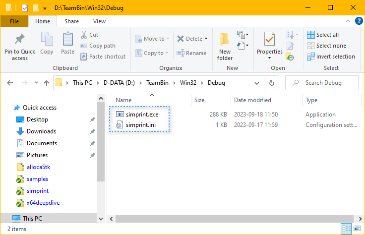

## Summary

This example demonstrates the most commonly used, and perhaps the most intuitive action of VSPG.

By using a triggering file named `VSPU-CopyOrClean.bat`, we tell VSPG to copy output EXE file
to extra target directories. We can think of `VSPU-CopyOrClean.bat` file as a hook. If a file 
by this name exists, it will be called(executed) by VSPG framework.

Typically, user places `VSPU-CopyOrClean.bat` side-by-side with .vcxproj, or inside sub-directory 
named `_VSPG`. VSPG framework will look into these two hook places and calls them if either of 
them exists. If they both exist, both will be called.

Convention of choice:
* If a hook action should be shared by the whole team (i.e., every staff of this software
project team should take this action when building this project), we place the hook file in `_VSPG`,
and that hook file is committed to source control like git/svn.
* If a team member wants to initiate some hook action according to his own preference (for example,
copy the output exe to a remote-machine shared folder for remote debugging), then the hook file 
if created side-by-side with .vcxproj, and the hook file is not committed to source control.

## Content of `VSPU-CopyOrClean.bat`

Normally, we don't write `VSPU-CopyOrClean.bat` from scratch, which is quite a bit verbose. 

We just grab a sample .bat from VSPG's stock files and do some customization to the file content.

In this example, 
* We use the sample file [`VSPU-CopyOrClean.bat.sample1`](../../_VSPG/samples/VSPU-CopyOrClean.bat.sample1) .
* We copy that sample file to `_VSPG` subdir and rename it to be `VSPU-CopyOrClean.bat` 
and do minor modification according to our own environment.

The actual working `_VSPG\VSPU-CopyOrClean.bat` file looks like this, which key content marked inside 
a dashed frame.


As we can see, instead of using Windows internal `copy` command to do file copy, we use VSPG-provided 
`CopyFilePatterns.bat` to do the copy work. The benefit is, `CopyFilePatterns.bat` does quite some 
extra and friendly work for us. We'll explain this later.

## Build the project in Visual Studio IDE

In Visual Studio IDE(we can use any version since VS2010), open simprint.vcxproj and build it, 
we see the following build output:


The output text in dashed blue frame is output by VSPG.

And we see that `simprint.exe` and `simprint.ini` are copied to `D:\TeamBin\Win32\Debug` folder.




## Explanation of details

### To activate VSPG, a manual tweak is needed in .vcxproj 

To bootstrap(activate) VSPG from a specific vcxproj, an `<Import>` statement needs to exist 
at end of the .vcxproj file. For a .vcxproj file created by Visual Studio project wizard, 
we need to add it manually.

We can see the following content at end of simprint.vcxproj .


Be aware, we must assign a correct directory for `<VSPG_BootsDir_NoTBS>`. 

In this example, `VSPG_BootsDir_NoTBS` has value `..\..\_VSPG\boots`, which is a relative directory, 
relative to the .vcxproj file. It guides VSIDE to find and import  the file 
`..\..\_VSPG\boots\_VSPG.props`. 

If you place VSPG framework files at a different directory, you should change `VSPG_BootsDir_NoTBS`'s 
value accordingly.


### `CopyFilePatterns.bat` copes with copy, as well as clean 

If we tell VSIDE to **clean** the simprint project, we'll see that The files in 
`D:\TeamBin\Win32\Debug` are also cleaned(deleted). This time, we see these messages in 
VSIDE Output pane, Build region:

```
1>------ Clean started: Project: simprint, Configuration: Debug Win32 ------
1>Build started 2023-09-18 12:11:45.
1>_PrepareForClean:
1>  Deleting file "D:\gitw\VSPG\demo-vsprojs\simprint\obj-v100\Win32\Debug\simprint.lastbuildstate".
1>VSPG_Clean:
1>  ...[VSPU-CopyOrClean.bat] START from D:\gitw\VSPG\demo-vsprojs\simprint\_VSPG
1>  ....[CopyFilePatterns.bat] EXEC: del "d:\TeamBin\Win32\Debug\simprint.exe"
1>  ....[CopyFilePatterns.bat] Deleting files matching pattern "D:\gitw\VSPG\demo-vsprojs\simprint\*.ini" ...
1>  ....[CopyFilePatterns.bat] . ref-dir: D:\gitw\VSPG\demo-vsprojs\simprint\bin-v100\Win32\Debug
1>  ....[CopyFilePatterns.bat] . del-dir: d:\TeamBin\Win32\Debug
1>  ....[CopyFilePatterns.bat] EXEC: del "d:\TeamBin\Win32\Debug\simprint.ini"
1>
1>Build succeeded.
1>
1>Time Elapsed 00:00:00.98
========== Clean: 1 succeeded, 0 failed, 0 skipped ==========
```

This is one of the benefits using `CopyFilePatterns.bat`, compared to manually calling `copy` 
command ourselves.

### Elegent message output from VSPG

We can intuitively see that, VSPG's message output is quite distinguishable from those of
Visual Studio(MSBuild) itself.
* For each VSPG output line, it is prefixed with multiple leading dots, indicating current 
bat's nested calling level (indention level).
* After the indention dots, there is indication of current .bat's filename, so that, if some 
VSPG .bat execution fails, we can easily identity the causing .bat .


Actually, we can make a text output same elegant like this. Instead of using `echo` command 
in .bat file, we use `call :Echos My text message` instead.

The `:Echos` is a bat function defined right inside `VSPU-CopyOrClean.bat`, so we can call it.

The function definition is quite simple:

```
:Echos
  REM This function preserves %ERRORLEVEL% for the caller,
  REM and, LastError does NOT pollute the caller.
  setlocal & set LastError=%ERRORLEVEL%
  echo %_vspgINDENTS%[%batfilenam%] %*
exit /b %LastError%

```

Be aware, avoid using batch meta-character in your text passed to `:Echos`, which would cause 
trouble.

Batch meta-characters contains: `^`, `&` etc.


### Then how does our `VSPU-CopyOrClean.bat` get invoked during the build?

That's because we have vcxproj import VSPG framework file `_VSPG.props` (described above),
and, `_VSPG.props` defines an MSBuild target named `VSPG_PostBuild` and hook it into MSBuild 
target tree, right after `PostBuildEvent`. The action of `VSPG_PostBuild` , is to execute 
`VSPG-Boots.bat` which internally calls `VSPU-CopyOrClean.bat`.

If you're interested, open `_VSPG.props` in a text editor, you will see such MSBuild statement:

```
  <!-- Define VSPG's Postbuild target -->

  <Target Name="VSPG_PostBuild" AfterTargets="PostBuildEvent">
    <Exec Command='$(ExportEnvvarsForVSPG) call "$(VSPG_BootsDir_NoTBS)\VSPG-Boots.bat" VSPG-PostBuild.bat'
    	WorkingDirectory="$(ProjectDir.TrimEnd('\'))"
    	IgnoreStandardErrorWarningFormat="true" 
    	/>
  </Target>
```

## More info

[General view of VSPG](../../_VSPG/VSPG-how-to-use.md)

[Details of VSPU-CopyOrClean.bat](../../_VSPG/samples/VSPU-CopyOrClean.bat.md)

