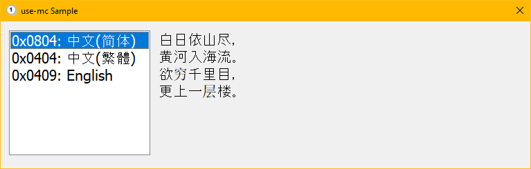
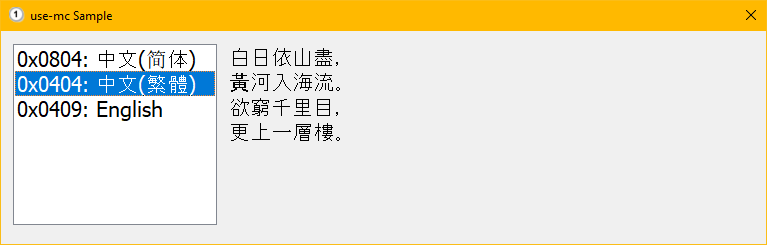
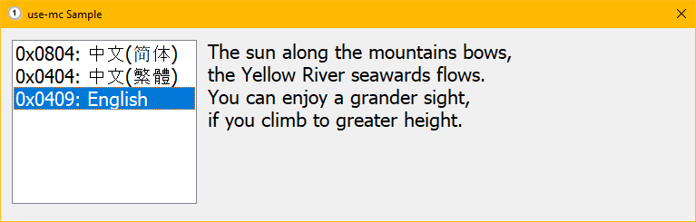
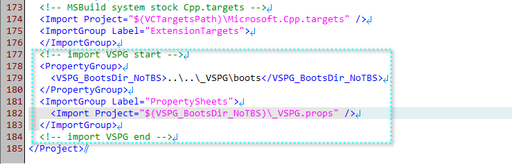
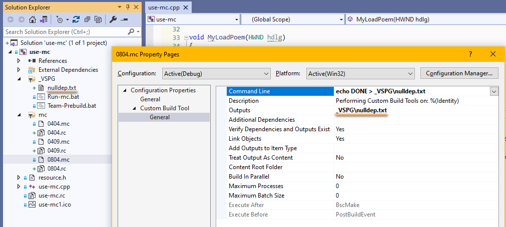
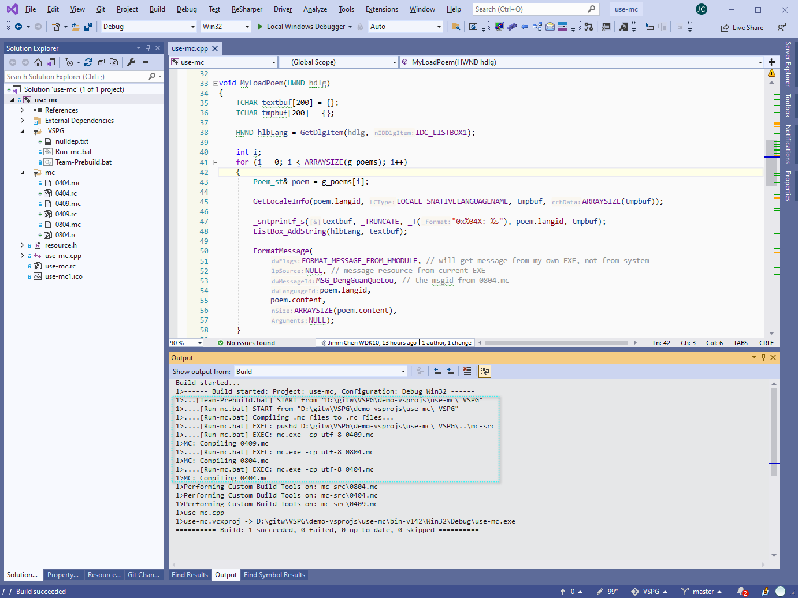

NOTE: This program should be built by VS2019. Using VS2010 will encounter error, because VS2010's mc.exe is too old to recognize UTF-8 encoded .mc files.

## use-mc program: key feature

This demo program use-mc, defines its source text(a poem text) not in C++ source file, but in Visual C++ .mc files.

To use text from .mc files, during project compiling, we need to call mc.exe to convert foo.mc into foo.rc.

Calling of mc.exe is not supported by vcxproj directly, so we (VSIDE user) need some "custom-build" action. To make this custom-build operation concrete, extensible and easily maintainable, we use VSPG to carry out this custom-build.

## use-mc program UI

Click a language name on the left-side, and the corresponding poem text is displayed on the right-side.







The poem texts of three languages are defined in 0804.mc, 0404.mc and 0409.mc respectively.

Take `0804.mc` for example, we need to compile it first,

```
mc.exe -cp utf-8 0804.mc
```

resulting in `0804.rc` and `MSG_0804.bin`. The `0804.rc` is fed to vcxproj so it is RC-compiled into `0804.res` and then finally linked into the EXE.


## How does mc.exe get invoked by VSPG?

First, import VSPG framework at end of vcxproj. We can see at end of [use-mc.vcxproj](use-mc.vcxproj) :



Second, create `Team-Prebuild.bat` and `Run-mc.bat`.

`Team-Prebuild.bat` is the standard VSPG triggering-file, so we know it will be called by VSPG framework, and we tell `Team-Prebuild.bat` to run `Run-mc.bat` in turn.

`Run-mc.bat` has these batch command at it core:

```
call :Echos Compiling .mc files to .rc files...

call :EchoAndExec pushd %batdir%\..\mc-src
if errorlevel 1 exit /b 4

call :EchoAndExec mc.exe -cp utf-8 0409.mc
if errorlevel 1 exit /b 4

call :EchoAndExec mc.exe -cp utf-8 0804.mc
if errorlevel 1 exit /b 4

call :EchoAndExec mc.exe -cp utf-8 0404.mc
if errorlevel 1 exit /b 4

exit /b 0
```

You see, `mc.exe` is called three times here, converting 0804.mc etc into 0804.rc etc.

Some comments here:

- Most of `Team-Prebuild.bat` is skeleton code. VSPG user almost always get a copy from [Team-Postbuild.bat.sample](/_VSPG/samples/Team-Postbuild.bat.sample), rename it to `Team-Prebuild.bat` and add user customized batch commands there.
- You can place `Team-Prebuild.bat` in the same directory as the .vcxproj, or place it into `_VSPG` subdir, the VSPG framework code will search both places, with the `_VSPG` subdir taking precedence.
- In theory, we can eliminate `Run-md.bat` and write its content directly inside `Team-Prebuild.bat`. But we think creating a standalone `Run-md.bat` is better, because the `Run-md.bat` filename shows our intention more vividly. Imaging, if you we have some different things to do in  `Team-Prebuild.bat`, we can create `action-foo.bat`, `action-bar.bat` etc to separate our batch actions clearly into their own bat files.
- `EchoAndExec` is a facility batch function, it echos your command and then execute your command, so that you don't have to write your command twice. VSPG author thinks that, to echo(show, print) the command that we are executing is an important debugging feature, because, in case current command fails, vcxproj user can clearly know the exact failing batch command line. This helps diagnose and fix the error quickly.


## Extra dependency settings in vcxproj 

If we stop here, there will be a problem: Once you update 0804.mc's content, you hope that Visual C++ F7 hotkey will relaunch build action, but it does not(just say everything up-to-date), that's because we have not setup 0804.mc's dependency on any other file managed by vcxproj.

So, in vcxproj, we have 0804.mc to depend on an imaginary file nulldep.txt, and the nulldep.txt is added to vcxproj as a source file. The following figure shows this:



Actual MSBuild statements in vcxproj are like this:

```
  <ItemGroup>
    <CustomBuild Include="mc-src\0804.mc">
      <FileType>Document</FileType>
      <Command>echo DONE &gt; _VSPG\nulldep.txt</Command>
      <Outputs>_VSPG\nulldep.txt</Outputs>
    </CustomBuild>
  <ItemGroup>
```

Wait. Here is a question, on previous image, since we have taken the effort to assign a "Custom Build Tool - Command Line" `echo DONE > _VSPG\nulldep.txt` for `0804.mc`, the why not call `mc.exe` there?

Well, this is a good question. It is totally feasible to do that(the "standard way" with VSIDE), achieving the same effect of calling mc.exe. VSPG author just wants to present you an alternative way to run our custom commands.

Imagine, you have 3 "types" of non-standard source files which require 3 custom tools, with "standard way", those custom things will find their way into .vcxproj, which makes .vcxproj something cluttered and not so easily maintainable. But with VSPG, you move all custom things out of .vcxproj and group them in .bat files which could bring more flexibility in the long run.


## Visual C++ compiling output message



The dashed blue box surrounded message lines are printed by VSPG.
